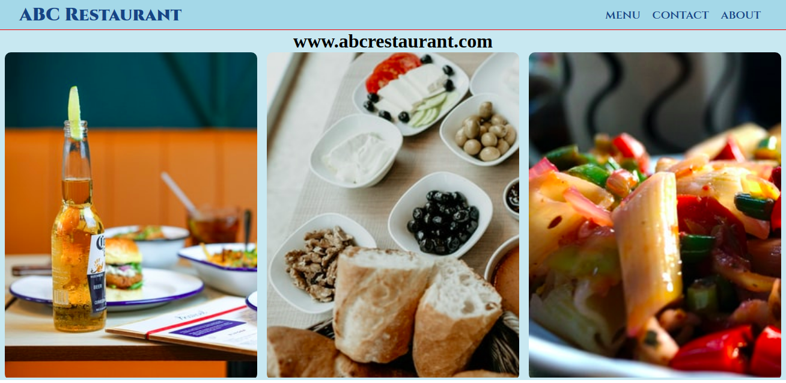

# Restaurant Page
> This project is a simple web-page for a restaurant which includes a home page, a menu page, a contact page and an about page.  
> This project is created as an assignment from JavaScript module of Microverse main curriculum. The main purpose of this project is to practice JavaScript ES6 (class, modules) and webpack.




## Built With
- JavaScript
- HTML 5 and CSS 3.

## Live Demo

[Live Demo Link](https://raw.githack.com/praz99/JS-restaurant-page/feature/restaurant-page/dist/index.html)

## Getting Started

Just fork or clone the project and you are good to go.

## Using

After forking or cloning the priject, navigate to the project directory and enter following commands in the terminal.

```npm install```  
```npm run build```

Now find the index.html page inside dist folder and open it in any web browser.

## Authors

👤 **Prajwal Thapa**

- Github: [praz99](https://github.com/praz99)
- Twitter: [@thapa_praz](https://twitter.com/thapa_praz)
- LinkedIn: [prazwal-thapa](https://linkedin.com/in/prazwal-thapa)
- Email: (t.prazwal@gmail.com)

## 🤝 Contributing

Contributions, issues and feature requests are welcome!

Feel free to check the [issues page](issues/).

## Show your support

Give a ⭐️ if you like this project!

## Acknowledgments

- [The Odin Project](https://www.theodinproject.com/courses/javascript/lessons/restaurant-page)
- [Webpack](https://webpack.js.org/)
- All images used are taken from [UnSplash](https://unsplash.com/)

## 📝 License

This project is [MIT](./LICENSE) licensed.